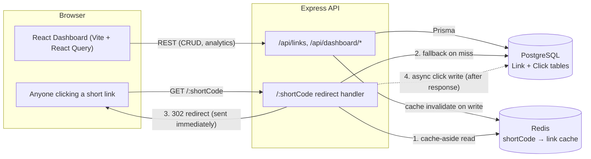
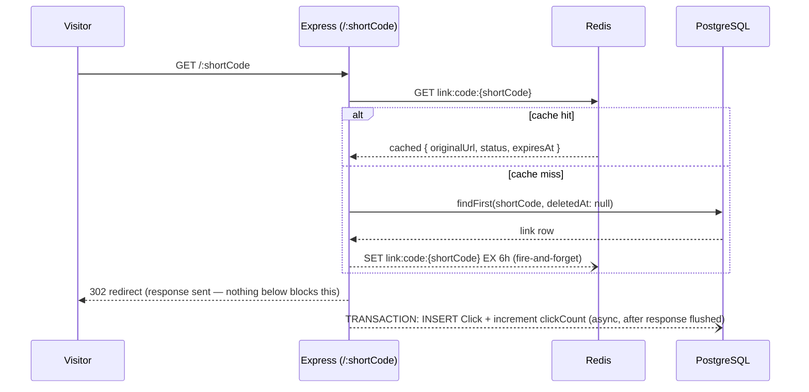
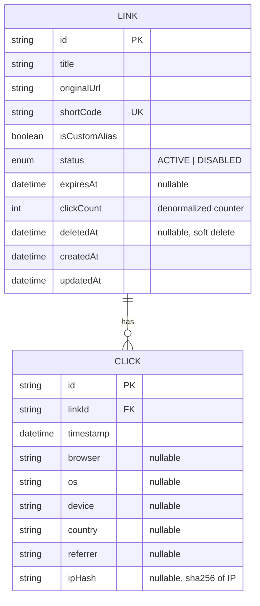

# Architecture

## Project structure

```
url-shortener/
├── backend/                 Express + TypeScript API
│   ├── src/
│   │   ├── config/          env, Prisma client, Redis client, logger
│   │   ├── routes/          Express routers (links, dashboard, redirect)
│   │   ├── controllers/     HTTP-layer glue (req/res <-> services)
│   │   ├── services/        business logic (link, redirect, analytics)
│   │   ├── middleware/      validation, error handling, rate limiting
│   │   ├── validators/      Zod schemas
│   │   └── utils/           short code generator, UA/GeoIP parsing, pagination
│   ├── prisma/               schema.prisma, migrations, seed script
│   └── tests/                 unit/ + integration/ (Jest + Supertest)
├── frontend/                 React + TypeScript + Vite dashboard
│   └── src/
│       ├── api/               axios client + typed endpoint functions
│       ├── hooks/              React Query hooks (useLinks, useDashboardStats, …)
│       ├── components/          LinksTable, LinkFormModal, charts/, …
│       └── pages/                DashboardPage, AnalyticsPage
├── docs/                      this folder
├── postman/                   Postman collection covering every endpoint
└── docker-compose.yml         postgres + redis + backend + frontend
```

The backend follows a conventional layered architecture: **routes** only wire HTTP
verbs to validation + a controller; **controllers** translate between Express
req/res and plain service calls; **services** hold all business logic and are the
only layer that touches Prisma/Redis directly. This keeps the redirect hot path
(`redirect.service.ts`) and the CRUD path (`link.service.ts`) independently testable
without an HTTP server.

## Components and data flow



## Redirect sequence (the <100ms path)



The click write happens **after** `res.redirect()` is called, so a slow database
write can never add latency to the redirect itself — the only thing on the
synchronous path is a single Redis `GET` (or a Postgres read on a cold cache, which
also repopulates Redis for next time). The `Click` insert and the `clickCount`
increment run inside one `prisma.$transaction`, so the two writes can't drift from
each other even though the pair as a whole is still fire-and-forget relative to the
redirect response.

## Database design



- `Link.clickCount` is a denormalized counter updated atomically
  (`increment`) alongside every `Click` insert — the dashboard's "Total Clicks" tile
  reads this instead of `COUNT(*)` across all clicks, keeping that query O(1) per
  link.
- `Click` is an append-only fact table; analytics endpoints aggregate it with
  `groupBy` (browser/device/country/referrer) and a raw `date_trunc` query (daily
  trend), computed on read rather than precomputed, since click volume in this
  product (marketing campaign links) doesn't warrant a rollup table.
- Soft delete (`deletedAt`) applies only to `Link`; `Click` rows cascade-delete only
  if a link is ever hard-deleted directly in the database (not exposed via the API).

**Indexes:** `Link.shortCode` is `@unique` (Postgres creates a unique btree index
automatically — no separate explicit index needed on top of it, which would just
double the write cost for no read benefit). Three composite indexes on `Link` match
the three query shapes the API actually issues: `[deletedAt, createdAt]` for the
default paginated list, `[deletedAt, status]` for the Active/Disabled filter, and
`[deletedAt, expiresAt]` for the Expired filter and the dashboard's expired-count
query. `Click` has a single `[linkId, timestamp]` composite index, covering both the
per-link analytics range queries and the `groupBy` aggregations.

## Effective link status

The API stores a raw `status` (`ACTIVE`/`DISABLED`, user-controlled) plus an
`expiresAt` timestamp, and derives one display status on every read:

```
EXPIRED   if expiresAt is in the past   (takes priority — time-based, unappealable)
DISABLED  else if status === DISABLED    (explicit admin action)
ACTIVE    otherwise
```

This single `deriveStatus()` function (`backend/src/services/link.service.ts`) is
the only place this rule is encoded, and both the dashboard stats aggregation and
the links-table status badge read from it, so the three states shown in the spec
(Active / Disabled / Expired) never disagree with each other.

## Why token-bucket-style Redis usage is scoped to the redirect path only

The constraint sheet for this assignment says "store all data in a database" — unlike
Assignment 1 (rate limiter), Redis here is explicitly a **cache**, not the primary
store. Every mutation (create/update/status/delete) writes to Postgres first and only
then invalidates the corresponding Redis key, so Redis can be flushed at any time with
zero data loss — it would simply cost the next few redirects a Postgres read.
